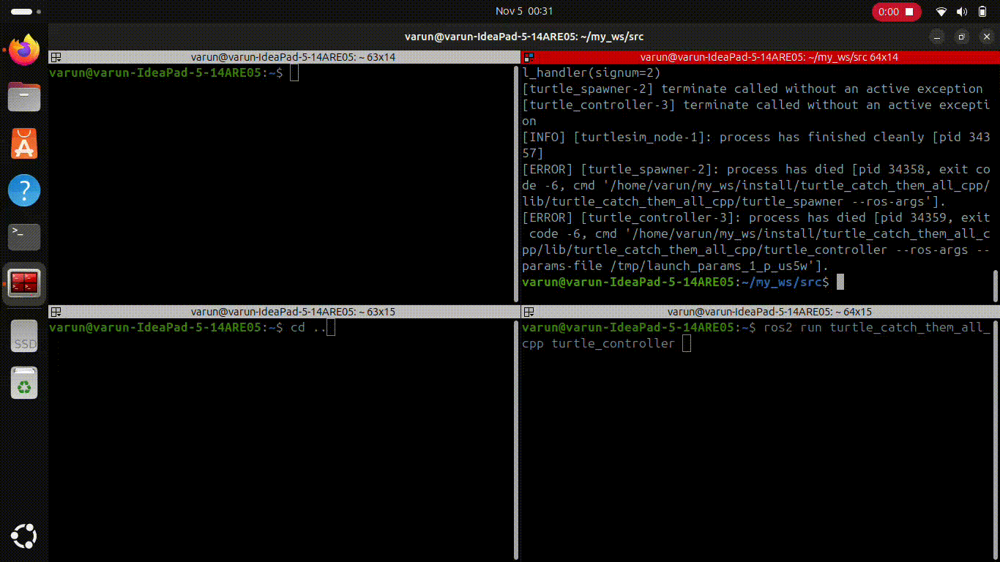

# Turtle_catch_them_all_Cpp

Welcome to the **Turtle Catch Them All** project! This ROS2 application allows for the dynamic spawning and management of turtles in a simulated environment using C++. The application supports spawning new turtles at random locations and provides functionality to catch (kill) them through a service interface.

## Table of Contents

- [Features](#features)
- [Installation](#installation)
- [Usage](#usage)
- [Contributing](#contributing)
- [License](#license)



## Features

- Spawns turtles at random positions in the simulation.
- Keeps track of all alive turtles and publishes their status.
- Allows users to catch (kill) turtles via a service call.
- Utilizes multithreading for asynchronous service calls to enhance performance.

## Installation

To get started with the project, follow these steps:

1. Clone the repository:
   ```
   git clone https://github.com/Varun-Ajith/Turtle_catch_them_all_Cpp.git
   ```
2. Navigate into the project directory:
   ```
   cd Turtle_catch_them_all_Cpp
   ```
3. Install the required dependencies:
   ```
   sudo apt-get install ros-jazzy-turtlesim
   ```
   Replace `jazzy` with your ROS2 distribution (e.g., `foxy`, `galactic`, etc.).
4. Build the package:
   ```
   colcon build
   ```
5. Source the workspace:
   ```
   source ~/.bashrc
   ```
## Usage
The project includes a launch file located at `launch_file/launch/turtleLauncher.launch.py`. You can use this launch file to start the turtlesim and the Turtle Spawner Node simultaneously.
```
ros2 launch launchfile turtleLauncher.launch.py
```
## Contributing

Contributions are welcome! If you'd like to contribute to this project, please fork the repository and submit a pull request.
## License

This project is licensed under the [Apache-2.0 License](LICENSE). See the LICENSE file for more information.


